# InfraHub — IT Management System

[](#)


Sistema **web** para gestão de TI (inventário, manutenções, setores/workstations, dashboard) com React + Vite + TailwindCSS no front, Node.js + Express + Sequelize + MySQL no back. Implantável no **Coolify** (front, back e MySQL como apps de um mesmo projeto; front e back via Dockerfile).

> **Monorepo** com dois projetos: `server/` onde está localizado o _backend_ e `client/` com o _frontend_ (SPA servida por nginx em produção, que faz reverse-proxy de `/api` para o backend).

## Screenshots

### Login

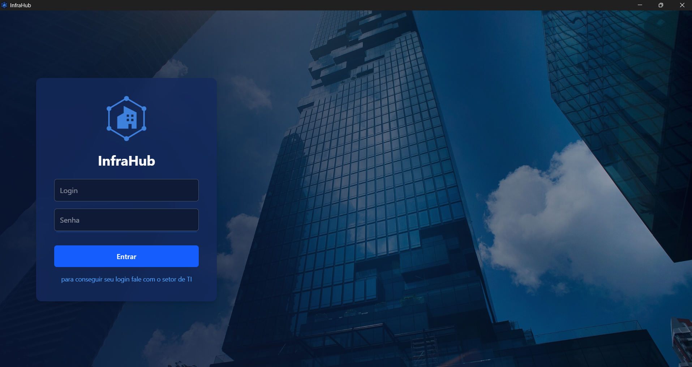

### Empresas

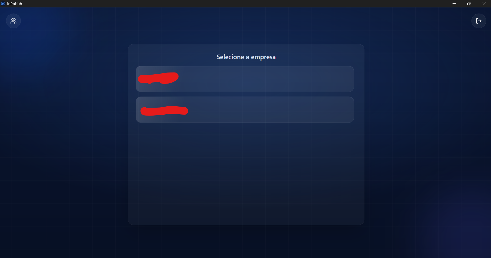

### Usuários

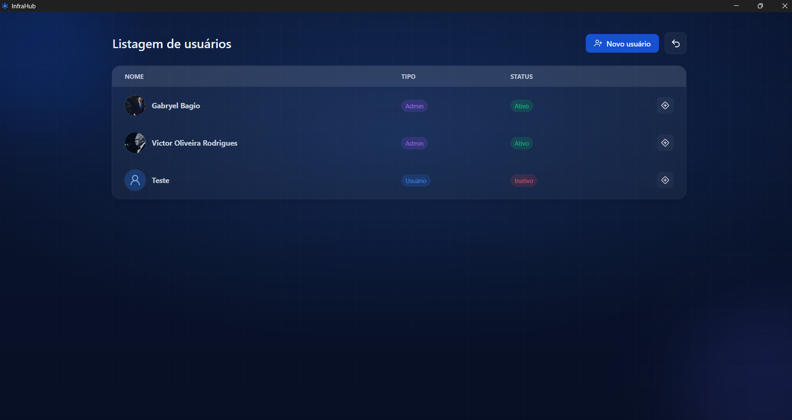
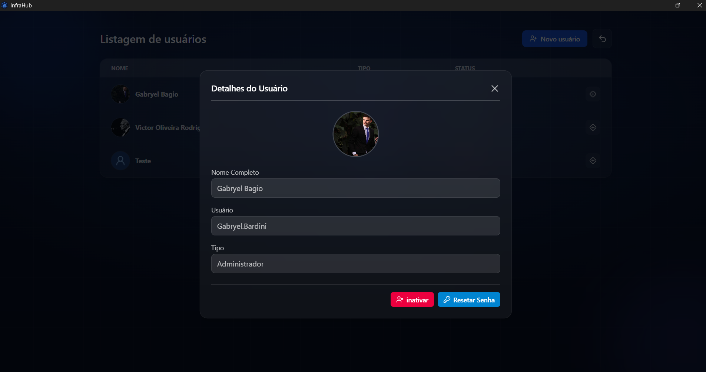

### Dashboard

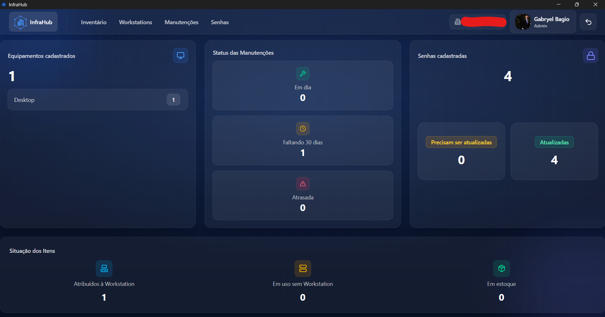

### Inventário

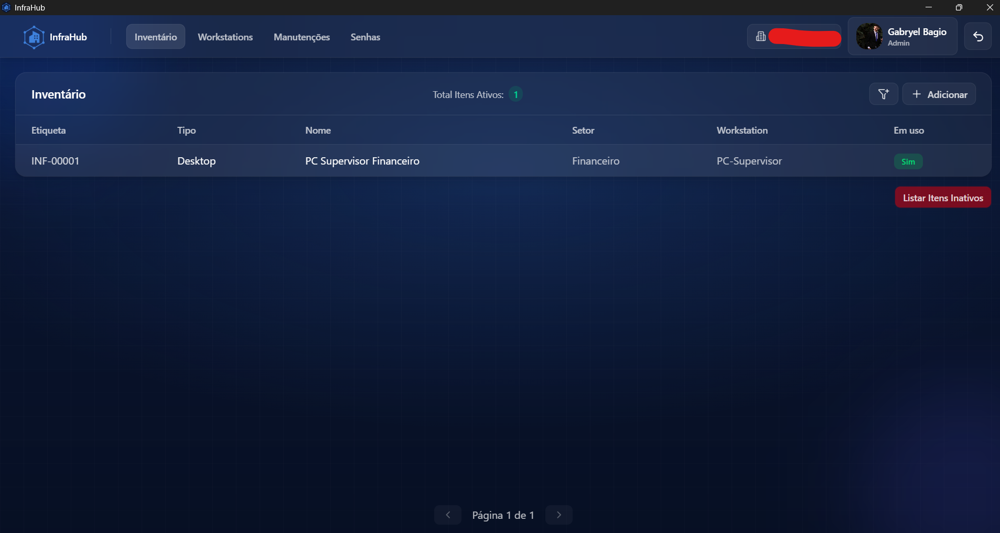
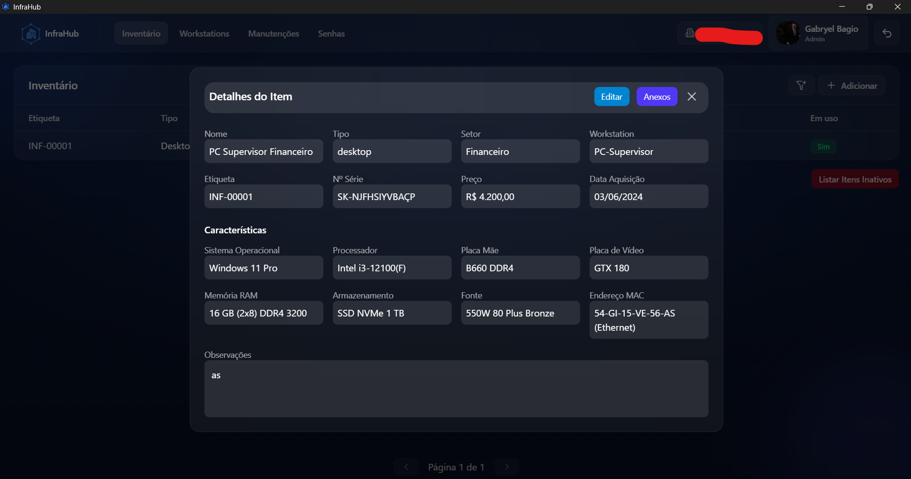
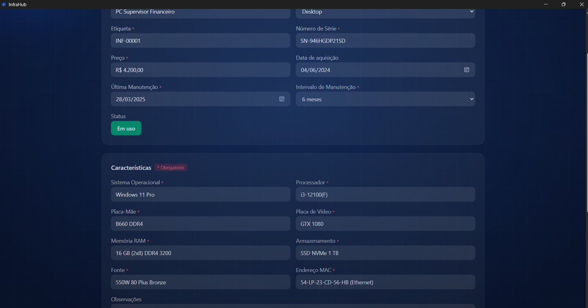

### Workstations

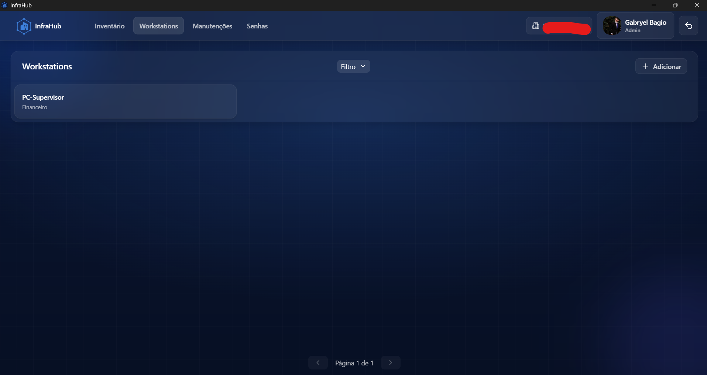
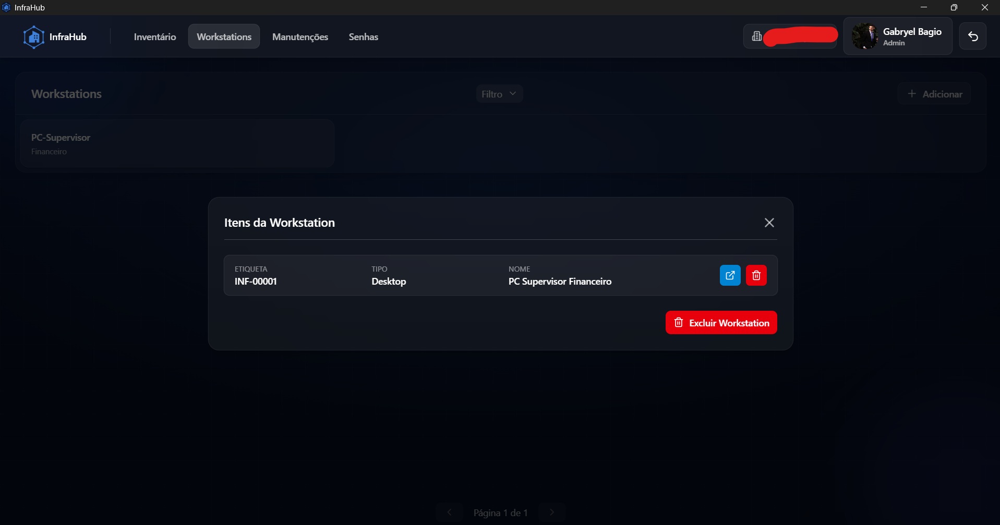

### Manutenções

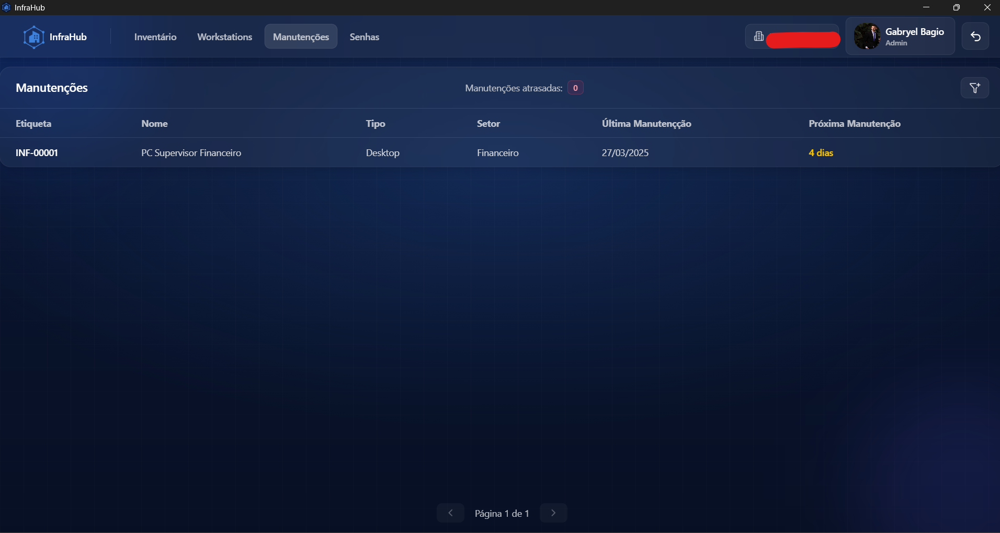
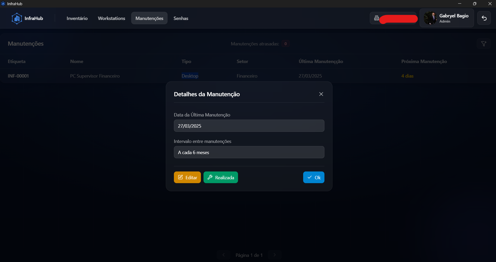

### Configurações Empresa

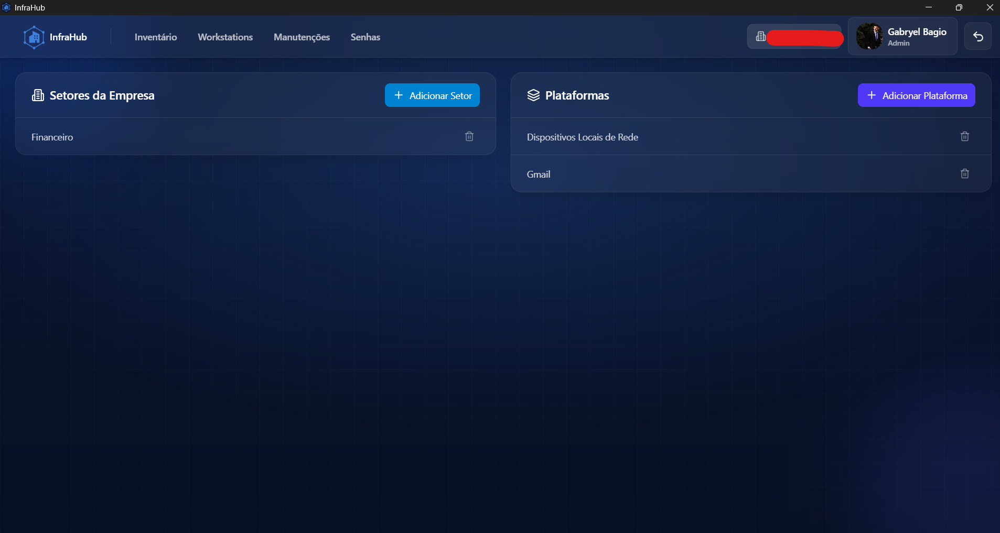

### Perfil

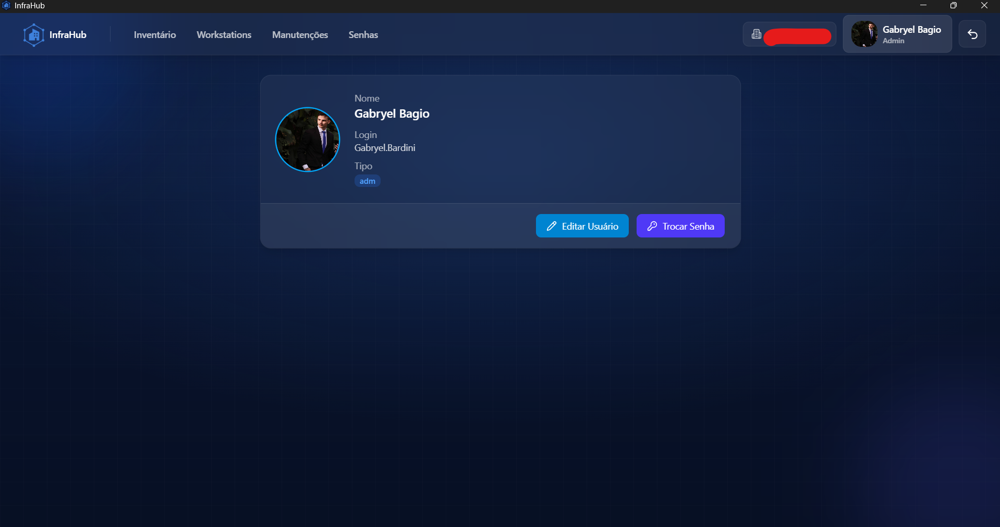
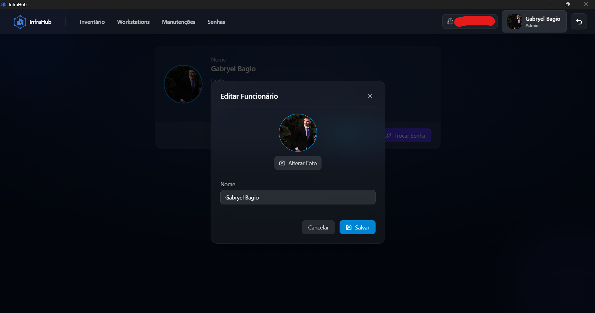

## Funcionalidades

- **Autenticação JWT**: Utilizada para realizar todas as funções. A cada login o backend grava o token num **cookie httpOnly** (`Secure` + `SameSite=Strict`), inacessível ao JavaScript — mitiga XSS. O front e a API ficam na **mesma origem** (nginx faz proxy de `/api`), então o cookie viaja sozinho e não há CORS no navegador.
- **Empresas / Setores / Workstations**: CRUD e relacionamento interno, com possibilidade de buscas e exibições separadas de acordo com a vontade do usuário.
- **Inventário de Itens**: Várias categorias de itens, com facilidade para implementar ainda mais itens.
  > Cada item possui características únicas, cujas quantidades e nomes são ditadas pela categoria.
- **Anexos por Item**: Capacidade de enviar anexos individuais por itens, sem mistura entre eles.
- **Manutenções**: Controle do intervalo entre manutenções, tendo a função de realizar a manutenção, com atualização dinâmica entre a última manutenção e o prazo entre elas.
- **Dashboard Dinâmico**: Atualizado automaticamente com os dados cadastrados no sistema, exibindo os principais indicadores dos dados cadastrados.
- **Perfil do Usuário**: Personalização leve, permitindo trocar seu nome, foto e senha, podendo ser realizado apenas pelo próprio usuário.

## Stack

### Frontend

- React 19 + Vite 7
- TailwindCSS v4
- React Router
- Lucide React
- Framer Motion

### Backend

- Node 18+
- Express 5
- Sequelize + mysql2
- Multer
- JSON Web Token
- Dotenv
- BCrypt
- Crypto
- Helmet, express-rate-limit, cookie-parser

### Deploy

- Docker (Dockerfile do front e do back) + nginx
- Coolify

## Estrutura do Repositório

```
it-management-system/
├─ client/               # Vite + React + Tailwind (SPA web)
│  ├─ src/               # código fonte (pages, components, services)
│  ├─ Dockerfile         # build Vite + nginx (estático + proxy /api)
│  ├─ nginx.conf.template# config do nginx (proxy /api, fallback SPA, headers)
│  └─ package.json       # scripts do frontend
├─ server/               # API Express + Sequelize
│  ├─ controllers/       # regras de negócio e respostas HTTP
│  ├─ models/            # Sequelize models + associações + hooks (Logs)
│  ├─ routes/            # endpoints organizados por recurso
│  ├─ middlewares/       # autenticação, upload, erros, etc.
│  ├─ config/database.js # conexão Sequelize (via .env)
│  ├─ config/seguranca.js# helpers de segurança (cookie, CORS, validação)
│  ├─ db/                # runner de migração + seed + migrations SQL
│  ├─ Dockerfile         # imagem do backend (migrate + start)
│  ├─ app.js             # app Express (helmet, CORS, cookie, rotas, erros)
│  └─ server.js          # bootstrap (valida env + listen)
├─ ferramentas/          # utilitários fora da stack web
│  └─ coletor-desktop/   # script PowerShell que coleta o hardware e cadastra o desktop
├─ uploads/              # anexos e fotos de perfil (gerado em runtime / volume)
├─ docker-compose.yml    # stack local completa (mysql + back + front)
├─ docs/deploy/coolify.md# guia de deploy no Coolify
└─ README.md             # este arquivo
```

## Pré-requisitos

- Node.js 18+ e npm
- MySQL (8.x recomendado)
- Docker (opcional, para rodar a stack completa / deploy)

## Comece Rápido

### Backend (API)

1. Duplique o arquivo `.env.example` para `.env` e preencha:

```
DB_DATABASE=nome-database
DB_USER=usuario-database
DB_PASSWORD=senha-database
DB_HOST=host-database
DB_PORT=3306

SECRET_KEY_PASSWORD=chave-secreta-para-criptografia
SECRET_KEY_LOGIN=chave-secreta-para-jwt
```

> **Dica**: Para AES-256-CBC use uma chave de **exatamente 32 caracteres** em `SECRET_KEY_PASSWORD` (o app valida no boot e não sobe se estiver errado).

2. Crie o schema (database vazio) e aplique as migrações com o runner (de dentro de `server/`):

```
cd server
npm install
npm run db:migrate    # cria as tabelas (forward-only, idempotente)
npm run db:seed       # admin/empresa iniciais (login: admin / admin123)
```

3. Suba o servidor da raiz do repo (porta padrão 3032 via `PORT`):

```
npm install
npm start
# ou: node --watch server/server.js
```

### Frontend (Vite)

1. Duplique o arquivo `.env.example` para `.env` (o default já serve para o dev):

```
VITE_API_BASE_URL=/api
```

> O front chama `/api`; o proxy do Vite (dev) e o nginx (prod) encaminham para o
> backend tirando o prefixo. Se o backend não estiver em `localhost:3003`, defina
> `VITE_API_PROXY_TARGET` no `.env`.

2. Instale as dependências e rode em modo dev:

```
cd client
npm install
npm run dev
```

> A aplicação ficará disponível em `http://localhost:5173`

## Docker (stack completa local)

O `docker-compose.yml` sobe **mysql + backend + frontend** com a mesma topologia do
deploy (front em nginx fazendo proxy de `/api`):

```
docker compose up --build
# O backend roda migrate + seed guardado no start: num banco zerado o
# admin/empresa são criados sozinhos (admin / admin123); com dados, o seed é ignorado.
# Front: http://localhost:8080
```

## Deploy (Coolify)

Front, back e MySQL sobem como **3 apps de um mesmo projeto** (front e back via
Dockerfile). Passo a passo, variáveis por app, rede interna e volume de uploads em
[docs/deploy/coolify.md](docs/deploy/coolify.md).

## Autenticação e Segurança

- Login gera **JWT** (expira em 8h) gravado num **cookie httpOnly** (`Secure` + `SameSite=Strict`); `POST /logout` limpa o cookie
- Front e API na **mesma origem** (nginx faz proxy de `/api`) — sem CORS no navegador
- CORS por **allowlist** (`CORS_ORIGIN`), **rate-limit** no `/login`, **helmet** e `trust proxy`
- Segredos validados no boot (`SECRET_KEY_PASSWORD` precisa ter 32 caracteres)

## Resumo dos endpoints

Base URL: `http://<host>:3032`

### Auth:

- `POST /login` - body `{ usuario_login, usuario_senha }` -> grava cookie httpOnly `token` e responde `{ resposta: { ... } }`
- `POST /logout` - limpa o cookie de sessão

### Usuário (`/usuario`) - adm

- `POST /` cadastrar
- `GET /` listar
- `PUT /inativa/:id` inativar
- `PUT /reseta/:id` reset de senha

### Empresa (`/empresa`)

- `GET /` listar empresas
- `GET /setores-workstations/:id` ( **adm** ) setores + workstations da empresa

### Setor (`/setor`) - adm

- `GET /:id` listar por empresa
- `POST /` criar
- `DELETE /:id` remover

### Itens (`/item`) - adm

- `GET /:id` itens por empresa
- `GET /inativos/:id`
- `GET /workstation/:id`
- `GET /full/:id` detalhe completo
- `POST /` **multipart** (anexos)
- `POST /importar` importação em massa (JSON, itens não-desktop)
- `POST /coletar-desktop` coleta automatizada de desktop (JSON: item + peças por nome, em transação)
- `PUT /:id` **multipart** (editar + anexos)
- `PUT /inativa/:id` inativar
- `PUT /workstation/remover/:id` desvincular

### Manutenção (`/manutencao`) - adm

- `GET /:id` listar por empresa
- `PUT /:id` atualizar registro
- `PUT /realizar/:id` marcar manutenção realizada

### Dashboard (`/dashboard`) - adm

- `GET /:id` dados resumidos da empresa

### Perfil (`/perfil`)

- `PUT /troca/:id` trocar senha
- `PUT /primeira/:id` primeira troca de senha obrigatória
- `PUT /:id` atualizar nome/foto (**multipart** campo `foto`)

### Workstaion (`/workstation`)

- `GET /:id` listar por empresa
- `POST /` cadastrar
- `DELETE /:id` excluir

> A sessão vai no **cookie httpOnly** (enviado automaticamente pelo navegador na
> mesma origem). Clientes não-browser podem usar `Authorization: Bearer <JWT>` como
> fallback. `Content-Type: application/json` nas rotas JSON.

## Scripts úteis

Raiz (backend)

```
npm start   // node -- watch server/server.js
```

Frontend (client/)

```
npm run dev           // Vite dev server (5173)
npm run build         // build de produção (dist/)
npm run preview       // serve build
```

## TODO

- [ ] Atualizar a tela para onde usuários de tipo `usuario` são redirecionados
- [ ] Criar o tipo de item `peça` e permitir vínculo a `desktop`/`notebook`, somando no valor final
- [ ] Melhorar as animações, para maior fluidez
- [ ] Ajuste de possíveis bugs visuais quando tabelas vazias ou situações mais específicas
