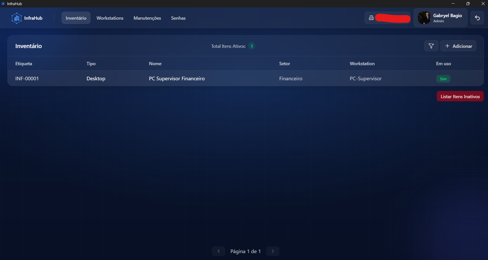

# InfraHub — IT Management System

[](#)


Sistema para gestão de TI (inventário, senhas, manutenções, setores/workstations, dashboard) com React + Vite + TailwindCSS no front, Node.js + Express + Sequelize + MySQL no back e empacotamento Tauri 2 para desktop.

> **Monorepo** com dois projetos: `server/` onde está localizado o _backend_ e `client/` com o _frontend_ + configurações **tauri**.

## Screenshots

### Login


### Empresas


### Usuários


### Dashboard


### Inventário




### Workstations


### Manutenções


### Senhas


### Configurações Empresa


### Perfil


## Funcionalidades

- **Autenticação JWT**: Utilizada para realizar todas as funções, usando um token recebido pelo _frontend_ a cada login.
  > O Token não é enviado com cookies, e sim como header, possibilitando o app rodar em tauri sem uma conexão HTTPS.
- **Empresas / Setores / Workstations**: CRUD e relacionamento interno, com possibilidade de buscas e exibições separadas de acordo com a vontade do usuário.
- **Inventário de Itens**: Várias categorias de itens, com facilidade para implementar ainda mais itens.
  > Cada item possui características únicas, cujas quantidades e nomes são ditadas pela categoria.
- **Anexos por Item**: Capacidade de enviar anexos individuais por itens, sem mistura entre eles.
- **Manutenções**: Controle do intervalo entre manutenções, tendo a função de realizar a manutenção, com atualização dinâmica entre a última manutenção e o prazo entre elas.
- **Senhas por Plataforma**: Senhas salvas criptografadas, descriptografadas apenas quando selecionadas individualmente, relação de trocas periódicas semelhante à manutenção.
- **Dashboard Dinâmico**: Atualizado automaticamente com os dados cadastrados no sistema, exibindo os principais indicadores dos dados cadastrados.
- **Perfil do Usuário**: Personalização leve, permitindo trocar seu nome, foto e senha, podendo ser realizado apenas pelo próprio usuário.

## Stack

### Frontend

- React 19 + Vite 7
- TailwindCSS v4
- React Router
- Lucide React
- Framer Motion

### Backend

- Node 18+
- Express 5
- Sequelize + mysql2
- Multer
- JSON Web Token
- Dotenv
- BCrypt
- Crypto

### Desktop

- Tauri 2

## Estrutura do Repositório

```
it-management-system/
├─ client/               # Vite + React + Tailwind + Tauri
│  ├─ src/               # código fonte (pages, components, services)
│  ├─ src-tauri/         # config Tauri 2
│  └─ package.json       # scripts do frontend/tauri
├─ server/               # API Express + Sequelize
│  ├─ controllers/       # regras de negócio e respostas HTTP
│  ├─ models/            # Sequelize models + associações + hooks (Logs)
│  ├─ routes/            # endpoints organizados por recurso
│  ├─ middlewares/       # autenticação, upload, erros, etc.
│  ├─ config/database.js # conexão Sequelize (via .env)
│  ├─ app.js             # app Express (CORS, rotas, erros)
│  └─ server.js          # bootstrap (porta 3032)
├─ migration/            # scripts SQL versionados
├─ uploads/              # anexos e fotos de perfil (gerado em runtime)
├─ .env.example          # exemplo de variáveis do backend
├─ docker-compose.yml    # serviço backend
├─ package.json          # scripts do backend
└─ README.md             # este arquivo
```

## Pré-requisitos

- Node.js 18+ e npm
- MySQL (8.x recomendado)
- Rust toolchain (opcional, apenas para empacotar com Tauri)

## Comece Rápido

### Backend (API)

1. Duplique o arquivo `.env.example` para `.env` e preencha:

```
DB_DATABASE=nome-database
DB_USER=usuario-database
DB_PASSWORD=senha-database
DB_HOST=host-database
DB_PORT=3306

SECRET_KEY_PASSWORD=chave-secreta-para-criptografia
SECRET_KEY_LOGIN=chave-secreta-para-jwt
```

> **Dica**: Para AES-256-CBC use uma chave de **32 caracteres** em `SECRET_KEY_PASSWORD` 2. Crie o schema e rode as migrações SQL em ordem:

```
mysql -u <user> -p -h <host> -P <porta> < migration/version-01.sql
mysql -u <user> -p -h <host> -P <porta> < migration/version-02.sql
mysql -u <user> -p -h <host> -P <porta> < migration/version-03.sql
mysql -u <user> -p -h <host> -P <porta> < migration/version-04.sql
```

3. Instale as dependências e suba o servidor (que irá rodar na porta 3032 por padrão) da raiz do repo:

```
npm install
npm start
# ou: node --watch server/server.js
```

### Frontend (Vite)

1. Duplique o arquivo `.env.example` para `.env` e preencha:

```
VITE_API_BASE_URL=http://localhost:3032
```

2. Instale as dependências e rode em modo dev:

```
cd client
npm install
npm run dev
```

> A aplicação ficará disponível em `http://localhost:5173`

### Desktop (Tauri) - Opcional

Com os pré-requisitos do Tauri instalados:

```
cd client
npm run tauri:dev       # dev com janela desktop
npm run tauri:build     # gera binários instaláveis
```

## Docker (somente backend)

O `docker-compose.yml` define um serviço **backend**. Para funcionar, o container precise enxergar um MySQL externo (configure `.env`).

> **Observação importante**: o `Dockerfile` de `server/` assume `package.json` no contexto de **server/**. Se você o mantiver o `package.json` na raiz (como no repositório), ajuste o compose para usaro contexto raiz:

```
docker-compose.yml
services:
  backend:
    build:
      context: .
      dockerfile: server/Dockerfile
    env_file: .env
    ports:
      - "3032:3032"
    restart: always
```

Depois:

```
docker compose up --build -d
```

## Autenticação e Segurança

- Login gera **JWT** com expiração de 8h (header: `Authorization: Bearer <token>`)
- Rotas protegidas exigem autenticação; algumas requerem papel **adm**
- Senhas de plataformas são criptografadas com `AES‑256‑CBC` usando `SECRET_KEY_PASSWORD`

## Resumo dos endpoints

Base URL: `http://<host>:3032`

### Auth:

- `POST /login` - body `{ usuario_login, usuario_senha }` -> `{ token, resposta: { ... } }`

### Usuário (`/usuario`) - adm

- `POST /` cadastrar
- `GET /` listar
- `PUT /inativa/:id` inativar
- `PUT /reseta/:id` reset de senha

### Empresa (`/empresa`)

- `GET /` listar empresas
- `GET /setores-workstations/:id` ( **adm** ) setores + workstations da empresa

### Setor (`/setor`) - adm

- `GET /:id` listar por empresa
- `POST /` criar
- `DELETE /:id` remover

### Itens (`/item`) - adm

- `GET /:id` itens por empresa
- `GET /intivos/:id`
- `GET /workstation/:id`
- `GET /full/:id` detalhe completo
- `POST /` **multipart** (anexos)
- `PUT /:id` **multipart** (editar + anexos)
- `PUT /inativa/:id` inativar
- `PUT /workstation/remover/:id` desvincular

### Plataforma (`/plataforma`) - adm

- `GET /` listar
- `POST /` criar
- `DELETE /:id` remover

### Senha (`/senha`)

- `GET /:id` listar por empresa
- `GET /full/:id` detalhe com **descriptografia**
- `POST /` criar (criptografa)
- `PUT /atualiza/:id` atualizar metadados
- `PUT /:id` alterar senha (recriptografa)
- `DELETE /:id` **adm**

### Manutenção (`/manutencao`) - adm

- `GET /:id` listar por empresa
- `PUT /:id` atualizar registro
- `PUT /realizar/:id` marcar manutenção realizada

### Dashboard (`/dashboard`) - adm

- `GET /:id` dados resumidos da empresa

### Perfil (`/perfil`)

- `PUT /troca/:id` trocar senha
- `PUT /primeira/:id` primeira troca de senha obrigatória
- `PUT /:id` atualizar nome/foto (**multipart** campo `foto`)

### Workstaion (`/workstation`)

- `GET /:id` listar por empresa
- `POST /` cadastrar
- `DELETE /:id` excluir

> Header padrão nas rotas protegidas:

```
Authorization: Bearer <JWT>
Content-Type: application/json
```

## Scripts úteis

Raiz (backend)

```
npm start   // node -- watch server/server.js
```

Frontend (client/)

```
npm run dev           // Vite dev server (5173)
npm run build         // build de produção
npm run preview       // serve build
npm run tauri         // CLI Tauri
npm run tauri:dev     // Tauri dev
npm run tauri:build   // build desktop
```

## TODO

- [ ] Atualizar a tela para onde usuários de tipo `usuario` são redirecionados
- [ ] Permitir que usuários de tipo `usuario` vejam apenas as senhas que eles mesmos cadastraram
- [ ] Criar o tipo de usuário `supervisor` (por setor) e permitir que veja as senhas dos liderados
- [ ] Criar o tipo de item `peça` e permitir vínculo a `desktop`/`notebook`, somando no valor final
- [ ] Melhorar as animações, para maior fluidez
- [ ] Ajuste de possíveis bugs visuais quando tabelas vazias ou situações mais específicas
